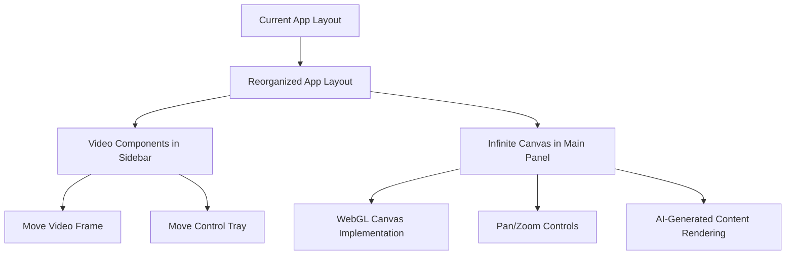
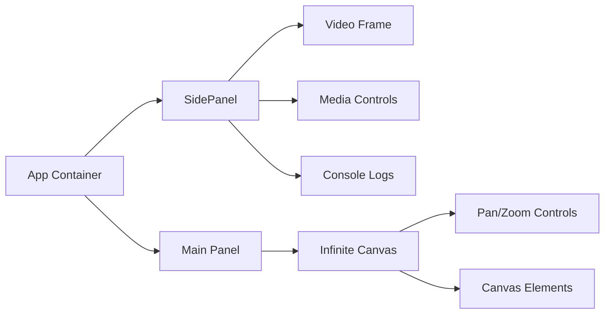
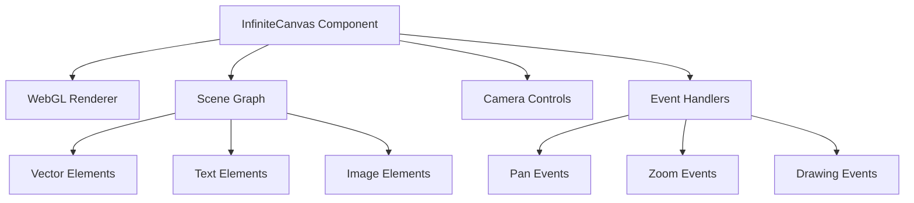

# Infinite Canvas AI Chat App: Implementation Plan

Based on my analysis of the codebase and our discussions, I've created a detailed plan for implementing the requested changes to your AI chat application. This document outlines the approach for moving the video frame and controls into the sidebar and implementing an infinite WebGL canvas in the main panel.

## 1. Overview of Changes



## 2. Current Architecture Analysis

The application currently has the following key components:

- **App.tsx**: Main application container
- **SidePanel.tsx**: Contains the console logging interface
- **Altair.tsx**: Visualization component in the main panel
- **ControlTray.tsx**: Contains media controls (webcam, screen capture, mic)
- **Video Element**: Currently in the main app area

## 3. Detailed Implementation Plan

### 3.1. UI Restructuring



#### 3.1.1. Modify `SidePanel.tsx`

- Restructure the SidePanel component to include three sections:
  - Video display area at the top
  - Media controls below the video
  - Console/log display area at the bottom
- Update the styling to accommodate the new elements
- Ensure the sidebar can be expanded/collapsed properly

#### 3.1.2. Update `App.tsx`

- Remove video elements from the main panel
- Initialize the new infinite canvas in the main panel area
- Update the media stream handling to connect to the video element in the sidebar

#### 3.1.3. Relocate Controls

- Move the ControlTray component into the SidePanel
- Adjust styling and positioning
- Ensure all functionality works in the new location

### 3.2. Infinite Canvas Implementation

#### 3.2.1. Canvas Component Structure



#### 3.2.2. Core Canvas Features

- WebGL-based rendering system
- Camera system with pan and zoom capabilities
- Scene graph for managing canvas elements
- Input handling for user interactions
- Communication with AI for generating content

#### 3.2.3. AI Content Generation

- API to allow the AI to create and manipulate elements on the canvas
- Support for text elements with different styles
- Support for basic vector graphics (circles, lines, boxes, polygons)
- Support for images

### 3.3. Recommended Libraries

Based on your requirements and preference for WebGL (with future 3D expansion), I recommend the following libraries:

1. **Three.js** (https://threejs.org/)

   - Full-featured WebGL library
   - Can handle both 2D and 3D graphics
   - Extensive community and documentation
   - Future-proof for 3D expansion

2. **react-three-fiber** (https://github.com/pmndrs/react-three-fiber)

   - React bindings for Three.js
   - Simplifies integration of Three.js into React applications
   - Declarative approach to 3D/2D rendering

3. **@react-three/drei** (https://github.com/pmndrs/drei)

   - Collection of useful helpers for react-three-fiber
   - Includes camera controls, events, etc.

4. **zustand** (already in your dependencies)
   - For state management of canvas elements
   - Will work well with the existing codebase

### 3.4. Implementation Steps

#### Phase 1: UI Restructuring

1. Create new component structure
2. Move video and controls to sidebar
3. Set up placeholder for infinite canvas
4. Test basic functionality

#### Phase 2: Canvas Implementation

1. Set up Three.js renderer and scene
2. Implement camera controls with pan and zoom
3. Create basic shape rendering (circles, lines, boxes, polygons)
4. Add text rendering capabilities
5. Implement image rendering

#### Phase 3: AI Integration

1. Create API for AI to interact with canvas
2. Implement commands for creating and manipulating elements
3. Connect canvas events to AI
4. Test AI-generated content on the canvas

## 4. File Structure Changes

```
src/
├── components/
│   ├── side-panel/
│   │   ├── SidePanel.tsx (updated)
│   │   └── side-panel.scss (updated)
│   ├── infinite-canvas/
│   │   ├── InfiniteCanvas.tsx (new)
│   │   ├── infinite-canvas.scss (new)
│   │   ├── CanvasControls.tsx (new)
│   │   └── canvas-elements/ (new directory)
│   │       ├── TextElement.tsx
│   │       ├── VectorElement.tsx
│   │       └── ImageElement.tsx
│   └── control-tray/ (relocated within SidePanel)
└── hooks/
    ├── use-canvas.ts (new)
    └── use-canvas-elements.ts (new)
```

## 5. Estimated Timeline

1. **UI Restructuring**: 2-3 days
2. **Basic Canvas Setup**: 3-4 days
3. **Advanced Canvas Features**: 5-7 days
4. **AI Integration**: 3-5 days
5. **Testing and Refinement**: 2-3 days

**Total**: 15-22 days

## 6. Future Expansion Considerations

- Support for 3D elements using Three.js capabilities
- Advanced animation capabilities
- Collaborative canvas features
- Exporting/importing canvas state
- More complex interactions between AI and canvas elements

## 7. Phased Implementation Strategy

To ensure stable development and testing at each step, we'll implement this project in clearly defined phases, each building on the successful completion of the previous phase.

### Phase 1: UI Restructuring (MVP)

**Goal**: Move video and controls to the sidebar while maintaining all current functionality.

**Steps**:

1. Create a simple placeholder in the main panel
2. Move the video element to the SidePanel component
3. Move the ControlTray component to the SidePanel
4. Test all media functionality (webcam, screen capture, mic) in the new layout
5. Ensure the sidebar expand/collapse functionality works with the new elements

**Verification**:

- Application runs without errors
- Video displays properly in sidebar
- All media controls function as before
- Sidebar can expand and collapse correctly

### Phase 2: Basic Canvas Implementation

**Goal**: Implement a simple WebGL canvas with basic pan and zoom.

**Steps**:

1. Add Three.js and react-three-fiber dependencies
2. Create a basic InfiniteCanvas component
3. Implement camera controls for panning and zooming
4. Add a simple grid or reference points to visualize movement
5. Add basic interaction handlers

**Verification**:

- Canvas renders in the main panel
- Pan and zoom functionality works smoothly
- Performance is acceptable

### Phase 3: Basic Shape Rendering

**Goal**: Implement the ability to render basic vector shapes on the canvas.

**Steps**:

1. Create components for basic shapes (circles, lines, rectangles, polygons)
2. Implement a simple state management system for canvas elements
3. Add the ability to manually place elements for testing
4. Ensure elements maintain their position during panning and zooming

**Verification**:

- Shapes render correctly on the canvas
- Shapes maintain correct positions during pan/zoom
- Multiple shapes can be displayed simultaneously

### Phase 4: Text and Image Support

**Goal**: Add support for text elements and images on the canvas.

**Steps**:

1. Implement text rendering with basic styling options
2. Add image rendering capabilities
3. Ensure proper scaling and positioning of all element types
4. Test combinations of different element types

**Verification**:

- Text elements render with correct styling
- Images display properly and scale appropriately
- All element types coexist correctly on the canvas

### Phase 5: AI Integration

**Goal**: Create an API for the AI to generate and manipulate canvas elements.

**Steps**:

1. Design and implement a command API for the AI
2. Add support for creating elements via commands
3. Add support for updating existing elements
4. Test the API with simulated AI requests

**Verification**:

- AI can create new elements on the canvas through commands
- AI can modify existing elements
- Command syntax is clear and extendable

### Phase 6: Full Integration and Refinement

**Goal**: Connect all components and refine the user experience.

**Steps**:

1. Connect the AI messaging system to the canvas command API
2. Implement proper error handling for AI commands
3. Refine the UI/UX for better usability
4. Optimize performance for complex scenes

**Verification**:

- End-to-end testing of complete workflow
- AI can create and manipulate canvas elements in response to user messages
- System handles errors and edge cases gracefully
- Performance remains smooth with many elements

Each phase builds upon the previous one, and we'll ensure each phase is fully functional before moving to the next. This approach minimizes risk and allows for early detection and correction of any issues.
